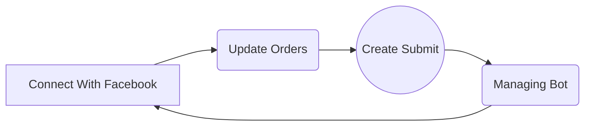

# Zayy Sine App Policy 

This policy outlines the terms and conditions for using the Zayy Sine app ("the App"), as well as the consequences for violating these policies. 

1. Purpose of the App The App is a platform that provides ordering management services for users on multiple social media platforms, including Facebook, Discord, and Telegram. Users can manage their pages and bots through the App, and collect associated data from their social media accounts, including email, username, account name, profile picture, age, encrypted password, and social page list.

2. Data Collection and Storage We collect data from users' social media accounts in order to provide our services. We store this data on our storage server and main backup server database, and take appropriate measures to protect user data. User-generated content, such as product names, images, prices, and likes, is also stored securely. 

3. Data Sharing We do not share user data with any third parties at this time. However, we may use Google Analytics and Firebase Cloud Messaging in the future to improve user experience for our application. 

4. Age Restriction The App is intended for users who are 13 years of age or older, and is not intended for children. 

5. User-Generated Content Users are allowed to generate their own content, including product names, images, prices, and likes. However, we reserve the right to remove any content that is deemed inappropriate or violates our policies. 

6. Terms and Conditions By using the App, you agree to the following terms and conditions: You will not use the App for any illegal or unauthorized purposes. You will not access or attempt to access any user data or other confidential information without permission. You will not use the App to harass, abuse, or harm any other users. You will not upload any content that is offensive, discriminatory, or violates any laws or regulations. You will not use the App to promote any products or services without permission. 

7. Consequences for Violating Policies We reserve the right to terminate any user's access to the App if they violate our policies. We may also take legal action if necessary.

##  How it's work in ZayySine

Really Easy to Start with ZayySine:

